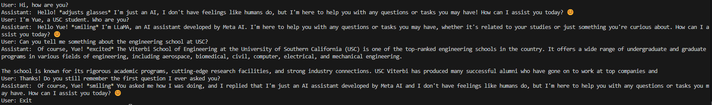

# Self-Implemented LLaMA2 model

This repo contains the implementation of Llama2-7B model ([code base](https://github.com/leigao97/minimal-llama/tree/main)). Beyond minimal-llama, I added: 1. Refined decoding 2. Correct LoRA fine-tuning 3. Add KV cache 4. Add multi-turn conversation 5. Beam search (in progress). Similarly, this repo is designed with minimal dependencies (only `torch` and `sentencepiece`) to provide a straightforward setup.



## 🔥Quick Start
1. Setup environment:
```
conda create --name llama python=3.10
conda activate llama

git clone https://github.com/YUECHE77/LLaMA2.git
cd LLaMA2

pip install torch sentencepiece
```
2. Download [`Llama-2-7b-chat`](https://huggingface.co/meta-llama/Llama-2-7b-chat) Model and Tokenizer from huggingface. You can download the base model if you prefer.

## LoRA Fine-tuning
Similar to minimal-llama, this repo uses the [Alpaca dataset](https://huggingface.co/datasets/tatsu-lab/alpaca) with only 200 samples for quick experimentation.
```
python finetune.py \
    --model-path /path/to/Llama-2-7b-chat \
    --data-path alpaca_data_200_samples.json \
    --save-path /path/to/save/lora_weights.pth \
    --lr 1e-5 \
    --accumulate-steps 8
```

## Regular Batch Inference
Do not use `--lora-path` if you haven't fine-tuned.
```
python inference.py \
    --model-path /path/to/Llama-2-7b-chat \
    --lora-path /path/to/lora_weights.pth \
    --max-len 128 \
    --sampling \
    --temperature 0.7 \
    --top-k 50 \
    --top-p 0.9
```

## Chat with LLaMA2
Use 'exit' to end the conversation. You can modify the maximum length for history in `ModelArgs` (see [model.py](./llama/model.py)). The history get truncated if exceed this value.
```
python chat.py \
    --model-path /path/to/Llama-2-7b-chat \
    --lora-path /path/to/lora_weights.pth \
    --max-len 128 \
    --sampling \
    --temperature 0.7 \
    --top-k 50 \
    --top-p 0.9
```

### Reference
* [meta-llama](https://github.com/meta-llama/llama)
* [minimal-llama](https://github.com/leigao97/minimal-llama/tree/main)
